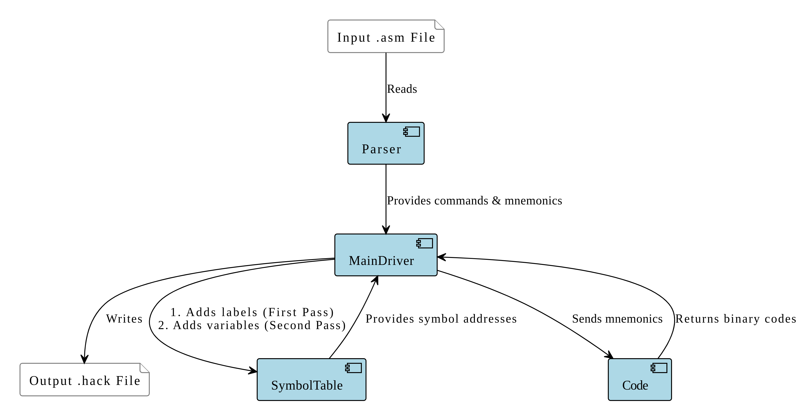
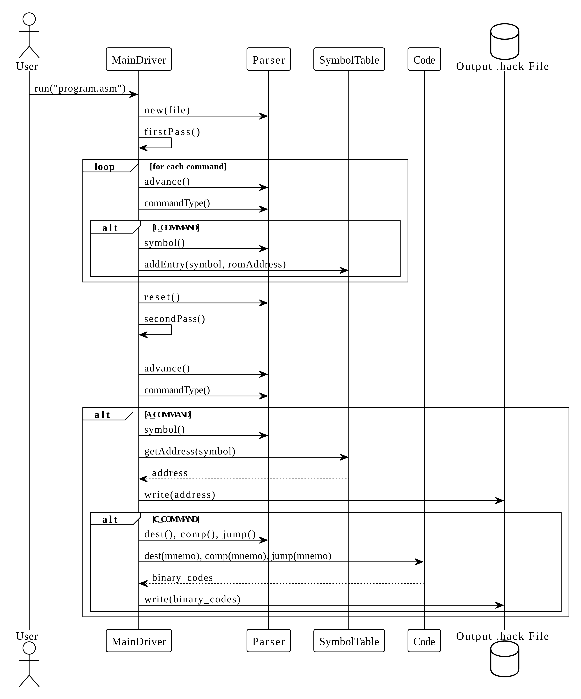

# GPR-16 Assembler

A two-pass assembler for the Hack assembly language, built in C++. This tool translates `.asm` source files into 16-bit binary machine code (`.hack` files) suitable for execution on the Hack computer platform, as specified in the *Nand2Tetris* course.

## Features

- **Two-Pass Assembly**: Efficiently resolves forward references to labels by building a symbol table in the first pass and generating code in the second.
- **Symbol Resolution**: Manages predefined symbols, label declarations, and variable declarations.
- **Full Instruction Set**: Supports A-instructions (`@value`), C-instructions (`dest=comp;jump`), and label pseudo-instructions (`(LABEL)`).
- **Robust Build System**: Uses CMake for cross-platform builds and testing.
- **Unit Tested**: Includes a comprehensive suite of unit tests using the GoogleTest framework.

## Module Architecture

The assembler is designed with a modular architecture, where each component has a distinct responsibility. This separation of concerns simplifies development, testing, and maintenance.

### Module Interaction Diagram



### Sequence Diagram



### Module Responsibilities

- **`MainDriver`**: The central orchestrator of the assembly process. It coordinates the two passes:
    1.  **First Pass**: Scans the source file to identify label declarations (`(LABEL)`) and populates the symbol table with their corresponding ROM addresses.
    2.  **Second Pass**: Re-scans the source file, translating each instruction into its binary representation. It resolves symbols by looking them up in the symbol table and assigns RAM addresses to new variables.

- **`Parser`**: The lexical analyzer. It is responsible for reading the input `.asm` file, ignoring whitespace and comments. For each command, it determines its type (A-command, C-command, or L-command) and provides methods to access its constituent parts (e.g., symbol, destination, computation, jump).

- **`Code`**: The code generator module. It translates the mnemonic components of C-instructions into their corresponding 3-bit (dest/jump) or 7-bit (comp) binary codes using static lookup tables.

- **`SymbolTable`**: Manages the mapping between symbolic names and their numeric memory addresses. The table is initialized with predefined symbols (like `SP`, `LCL`, `R0-R15`) and is populated with user-defined labels and variables during the assembly process.

- **`Utils`**: A utility module containing shared data structures and enumerations, such as `CommandType`, used across the entire application.

## Build and Run

This project uses CMake and includes presets for easy configuration and building.

### Prerequisites
- A C++17 compatible compiler (e.g., GCC, Clang, MSVC)
- CMake (version 3.15 or newer)

### Build Instructions

1.  **Configure the project using a preset (e.g., `Release`):**
    ```bash
    cmake --preset=Release
    ```

2.  **Build the project:**
    ```bash
    cmake --build --preset=Release
    ```
    The executable will be located in the `Release/` directory.

### Usage Example

Here is a simple walk-through of assembling a small Hack program.

**1. Input Assembly Code (`Add.asm`)**

This program adds the numbers `2` and `3` and stores the result in memory at address `0` (i.e., `R0`).

```assembly
// Adds 2 and 3, stores result in R0
@2
D=A      // D = 2
@3
D=D+A    // D = 2 + 3
@0
M=D      // M[0] = 5
```

**2. Running the Assembler**

```bash
./Release/Assembler /path/to/Add.asm
```

**3. Output Machine Code (`Add.hack`)**

The assembler generates the following 16-bit binary machine code, which can be run on the Hack computer.

```
0000000000000010
1110110000010000
0000000000000011
1110000010010000
0000000000000000
1110001100001000
```

## Testing

The project includes a suite of unit tests built with GoogleTest.

1.  **Configure for debugging and testing:**
    ```bash
    cmake --preset=Debug
    ```

2.  **Build the tests:**
    ```bash
    cmake --build --preset=Debug
    ```

3.  **Run the tests using CTest:**
    ```bash
    ctest --preset=Debug
    ```
